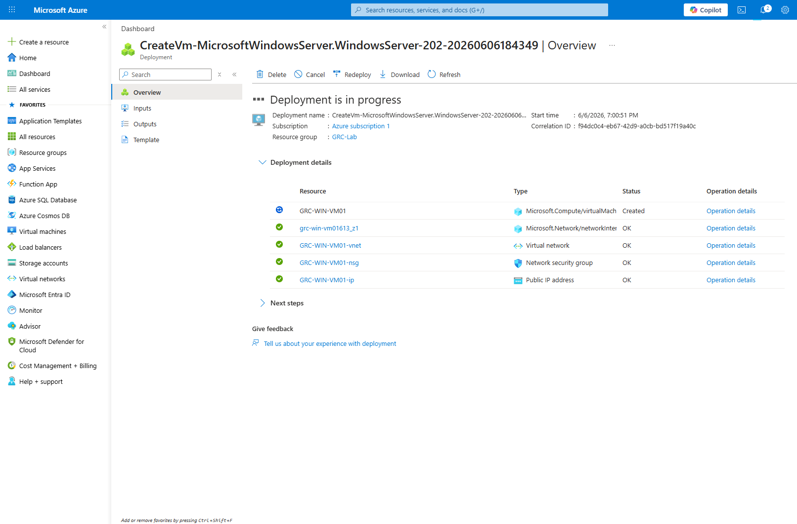
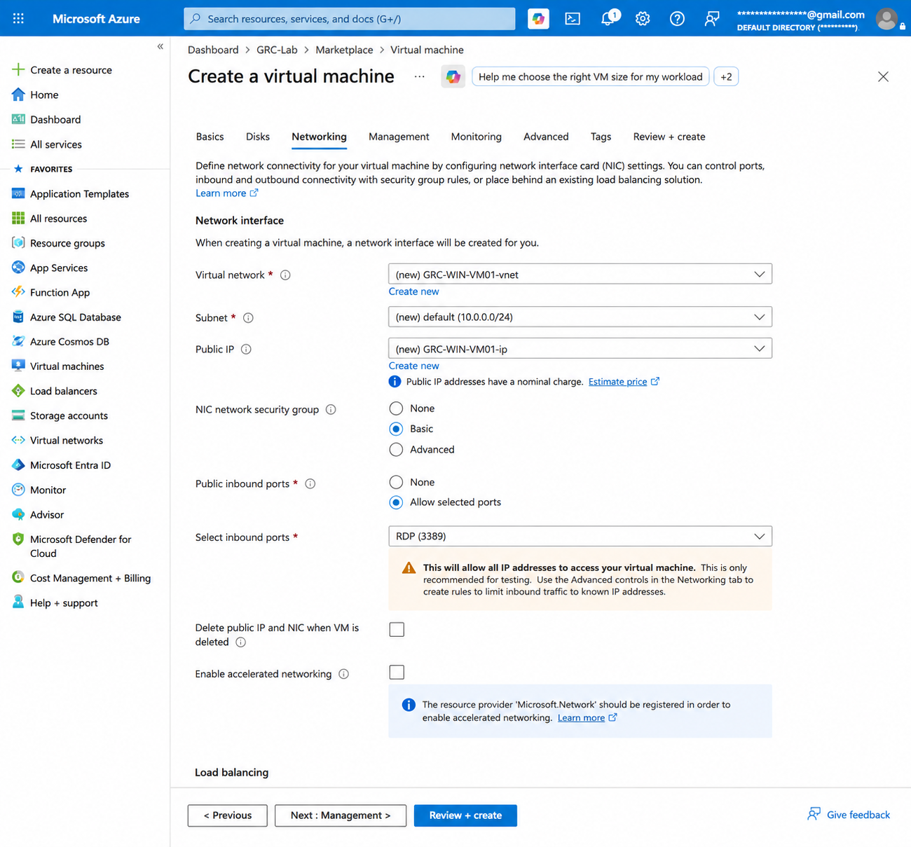
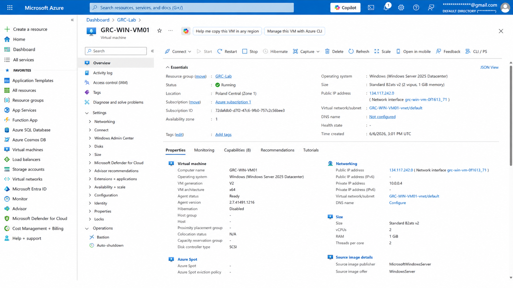
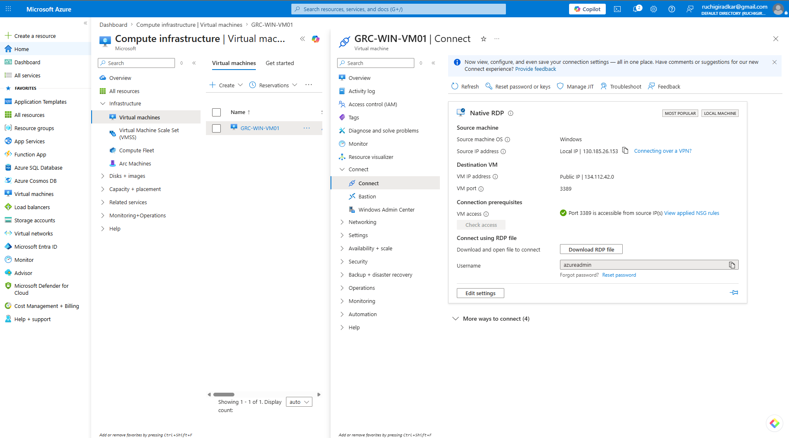
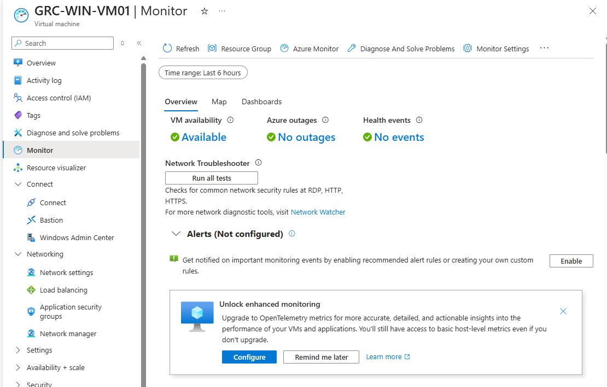

# Microsoft Azure Cloud Security Risk Assessment

## Project Overview

This project demonstrates a Governance, Risk, and Compliance (GRC) assessment performed on a Microsoft Azure Infrastructure-as-a-Service (IaaS) environment.

The objective was to deploy a Windows Server virtual machine in Azure, evaluate its security posture, identify security risks, assess potential business impact, and recommend security controls aligned with industry-recognized cybersecurity frameworks.

The assessment was performed using a risk-based methodology commonly used by security consulting firms, enterprise security teams, SOC teams, and GRC functions.

---

## Full Assessment Report

The complete cloud security risk assessment report is available here:

[Download the Cloud Security Risk Assessment Report](Report/Cloud_Security_Risk_Assessment_Report.pdf)

---

## Risk Register

The supporting risk register is available here:

[View the Azure GRC Risk Register](Report/Azure_GRC_Risk_Register.xlsx)

---

## Objectives

- Deploy a Microsoft Azure Windows Server Virtual Machine
- Configure networking and remote administration
- Identify cloud security risks and misconfigurations
- Evaluate attack surface exposure
- Perform risk analysis and risk scoring
- Map findings to security frameworks
- Recommend remediation strategies

---

## Technologies Used

### Cloud Platform

- Microsoft Azure

### Infrastructure Components

- Azure Virtual Machine
- Azure Virtual Network (VNet)
- Azure Network Security Group (NSG)
- Public IP Address
- Azure Monitor
- Windows Server 2025 Datacenter

### Security Concepts

- Risk Assessment
- Threat Modeling
- Cloud Governance
- Identity and Access Management
- Network Security
- Security Monitoring
- Security Control Mapping
- Technical-to-Business Risk Translation

### Frameworks Referenced

- NIST Cybersecurity Framework (CSF)
- CIS Critical Security Controls
- ISO/IEC 27001

---

## Environment Architecture

The assessment environment consisted of a single Azure-hosted Windows Server virtual machine deployed for cloud security risk assessment purposes.

| Component | Configuration |
|----------|---------------|
| Cloud Provider | Microsoft Azure |
| Resource Group | GRC-Lab |
| Virtual Machine | GRC-WIN-VM01 |
| Operating System | Windows Server 2025 Datacenter |
| Region | Poland Central |
| Remote Access | RDP (TCP/3389) |
| Public Exposure | Public IP Enabled |
| Monitoring | Azure Monitor |
| Logging | Windows Security Event Logs |

---

## Assessment Methodology

The assessment followed a structured Governance, Risk, and Compliance methodology.

1. Asset Identification
2. Threat Identification
3. Vulnerability Assessment
4. Risk Analysis
5. Risk Scoring
6. Security Control Mapping
7. Mitigation Planning

Risk scoring was calculated using the following model:

**Risk Score = Likelihood × Impact**

### Likelihood Scale

| Score | Description |
|------|-------------|
| 1 | Rare |
| 2 | Unlikely |
| 3 | Possible |
| 4 | Likely |
| 5 | Almost Certain |

### Impact Scale

| Score | Description |
|------|-------------|
| 1 | Minimal |
| 2 | Minor |
| 3 | Moderate |
| 4 | High |
| 5 | Critical |

---

## Key Findings

### Finding 1 – Public RDP Exposure

**Observation**

The virtual machine was configured with an inbound Network Security Group rule allowing Remote Desktop Protocol access over TCP/3389 from the internet.

**Risk**

Publicly exposed RDP services are frequently targeted by threat actors and automated scanning tools. This exposure increases the likelihood of:

- Brute-force attacks
- Credential stuffing
- Password spraying
- Unauthorized remote access attempts
- Initial access attempts by ransomware operators

**Severity:** High

---

### Finding 2 – Lack of Multi-Factor Authentication

**Observation**

Administrative access relied on username and password authentication without evidence of Multi-Factor Authentication enforcement.

**Risk**

If administrative credentials are compromised, an attacker could gain privileged access to the virtual machine or related cloud resources.

**Severity:** High

---

### Finding 3 – Limited Monitoring Configuration

**Observation**

Azure Monitor was available, but alerting had not been configured.

**Risk**

Lack of configured alerts can delay detection and response to suspicious or malicious activity.

**Severity:** Medium

---

### Finding 4 – Default Operating System Configuration

**Observation**

The Windows Server virtual machine was deployed using baseline/default configuration.

**Risk**

Default configurations may not meet enterprise hardening expectations and can increase exposure to known attack techniques if not reviewed and secured.

**Severity:** Medium

---

## Risk Register

| Asset | Threat | Likelihood | Impact | Risk Score | Risk Rating |
|------|--------|------------|--------|------------|-------------|
| Public RDP | Brute-force Attack | 4 | 4 | 16 | Critical |
| Administrator Account | Credential Compromise | 3 | 5 | 15 | Critical |
| Operating System | Vulnerability Exploitation | 3 | 4 | 12 | High |
| Azure Subscription | Unauthorized Configuration Changes | 2 | 5 | 10 | Medium |
| Security Monitoring | Delayed Detection | 3 | 3 | 9 | Medium |

---

## Security Control Mapping

| Risk | Recommended Control | Control Type | Framework Alignment |
|-----|----------------------|--------------|---------------------|
| Public RDP Exposure | Restrict inbound NSG rules to trusted IP ranges | Preventive | CIS Control 4 |
| Credential Theft | Enforce Multi-Factor Authentication | Preventive | NIST CSF PR.AC |
| Vulnerability Exploitation | Implement patch management | Corrective | CIS Control 7 |
| Lack of Monitoring | Enable centralized logging and alerting | Detective | NIST CSF DE.CM |
| Privilege Misuse | Implement Role-Based Access Control | Preventive | CIS Control 5 |

---

## Security Recommendations

### Immediate Actions

- Restrict RDP access to trusted IP ranges
- Implement Multi-Factor Authentication for privileged accounts
- Deploy Azure Bastion for secure remote access
- Review and tighten Network Security Group rules

### Short-Term Improvements

- Enable Microsoft Defender for Cloud
- Configure Azure Monitor alerts
- Implement centralized logging
- Review administrative account usage
- Enable vulnerability assessment where applicable

### Long-Term Improvements

- Implement Role-Based Access Control
- Develop secure Azure baseline configurations
- Apply CIS hardening recommendations
- Conduct periodic cloud security reviews
- Maintain evidence for audit and compliance readiness

---

## Evidence Collected

### Azure VM Deployment

Deployment of Windows Server 2025 Datacenter in Microsoft Azure.

---

### Azure Network Configuration

Configuration of Virtual Network, Subnet, Public IP, and Network Security Group.

---

### Azure VM Overview

Review of deployed infrastructure and resource configuration.

---

### RDP Connectivity Review

Validation of remote administration access using RDP.

---

### Network Security Group Review

Review of inbound security rules exposing TCP/3389.

---

### Azure Monitoring Review

Assessment of Azure Monitor and alerting configuration.

---

## Skills Demonstrated

- Cloud Security Assessment
- Microsoft Azure Administration
- Azure Network Security Review
- Security Risk Analysis
- Threat Modeling
- Vulnerability Assessment
- Governance, Risk, and Compliance
- Security Control Evaluation
- Risk Register Development
- Security Documentation
- Security Reporting
- Technical-to-Business Risk Translation

---

## Project Outcome

This project demonstrates the ability to assess cloud infrastructure from a Governance, Risk, and Compliance perspective by identifying security weaknesses, evaluating business impact, prioritizing risks, and recommending controls aligned with recognized cybersecurity frameworks.

The assessment reflects real-world cloud security review activities commonly performed by Cybersecurity Analysts, GRC Analysts, Cloud Security Engineers, SOC Analysts, and Security Consultants.

